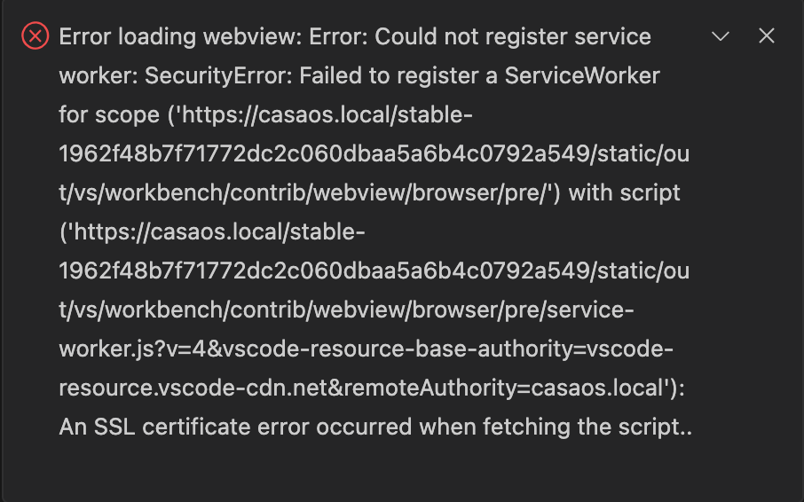

# docker-code-server

The project aims to provide a simple solution to run ***code-server*** in docker with a self-signed SSL certificate and persistent data support.

## Quick start

### HTTP only

1. Clone the repository
```bash
   git clone https://github.com/sund3RRR/docker-code-server.git
```
2. Run the docker compose
```bash
    docker compose up -d
```

### HTTPS with self-signed certificate
1. Clone the repository
```bash
   git clone https://github.com/sund3RRR/docker-code-server.git
```
2. Generate a self-signed certificate
```bash
    ./scripts/gen-cert
```
3. Run the docker compose
```bash
    docker-compose up -d -f docker-compose-https.yaml
```

### CasaOS manifest
1. Clone the repository
```bash
   git clone https://github.com/sund3RRR/docker-code-server.git
```
2. Generate a self-signed certificate
```bash
    ./scripts/gen-cert
```
3. Copy the `nginx` folder for nginx container
```bash
    mkdir -p /DATA/AppData/code-server
    cp -r nginx/ /DATA/AppData/code-server/
```
4. Select `code-server-https.yaml` from casaos/ folder to add new app

## Features
- HTTPS with a self-signed certificate
- A non-root user in the code-server container
- Persistent data for the container's home directory
- Pre-installed `nix` package manager with persistent data
- Docker socket for interacting with docker inside the container

## Configuration

### Environment variables
| ENV      | VALUE           | Description               |
|----------|-----------------|---------------------------|
| PASSWORD | password        | code-server auth password |
| PGID     | 1000            | code-server user PGID     |
| PUID     | 1000            | code-server user PUID     |
| TZ       | Europe/London   | timezone                  |

The `PGID:PUID` must be set to `1000:1000` to allow the code-server full access to the mounted Workspace folder

### Volumes
| Source                   | Target                   | Description                        |
|--------------------------|--------------------------|------------------------------------|
| ./code-server/coder       | /home/coder             | Main user directory                |
| ./code-server/nix         | /nix                    | Directory for Nix system           |
| ./Workspace               | /home/coder/Workspace   | User's workspace directory         |
| /var/run/docker.sock      | /var/run/docker.sock    | Docker socket for interaction      |
| ./nginx/certs             | /etc/nginx/certs        | Directory for Nginx certificates   |
| ./nginx/nginx.conf        | /etc/nginx/nginx.conf   | Main Nginx configuration file      |

## Nix package manager
`nix-env` is preinstalled using the `home-manager`, so you can install any packages into the container via nix.

If `/nix` and `/home/coder` are mounted, the installed packages will not disappear after restarting the container.

To install packages declaratively, you can edit the `~/.config/home-manager/home.nix` file:
```nix
    {config, pkgs, lib, ...}:
    {
        # enable quirks (e.g. set $XDG_DATA_DIRS environment variable) for non NixOS operating systems 
        targets.genericLinux.enable = true;

        # enable proprietary software
        nixpkgs.config.allowUnfree = true;

        # install software
        home.packages = with pkgs; [
            # your packages here
            nano
        ];

        home.username = "coder";
        home.homeDirectory = "/home/coder";
        home.stateVersion = "24.11";
    }
```

[!WARNING]
The first launch of `code-server` can be long due to the installation of `nix-env`.

## Limitations
- **Chromium-based** browsers can prohibit `code-server` from working correctly with a self-signed certificate. I don't know how to fix this error in chromium, so you can try  **Firefox** or **Safari**
